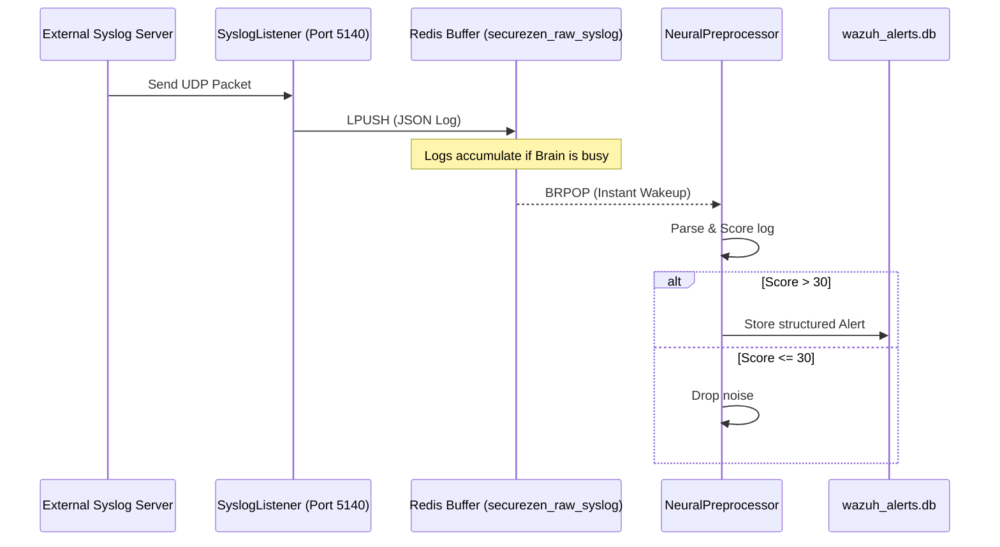

# Redis Buffer Internal Architecture

This document provides a deep-dive into the technical implementation of the Redis-based log buffering system used in the SecureZen AI SOC.

## 📌 Overview
Redis acts as a high-performance **Message Broker** and **Durability Buffer** between raw data ingestion (Syslog) and intelligent analysis (AI Pre-processor).

## 🧩 Architectural Components

### 1. The Producer: `SyslogListener`
- **Socket Type**: UDP (User Datagram Protocol).
- **Binding**: Listens on `0.0.0.0:5140`.
- **Logic**: 
    1. Receives raw binary packet.
    2. Decodes to UTF-8.
    3. Wraps in JSON with metadata (sender IP, arrival timestamp).
    4. Calls **LPUSH** on the Redis queue.

### 2. The Infrastructure: Redis `LIST`
- **Key Name**: `securezen_raw_syslog`.
- **Data Structure**: Redis List (Linked List implementation).
- **Operation Mode**: **FIFO** (First-In, First-Out).
- **Capacity**: Can handle millions of entries limited only by available RAM.
- **Persistence**: Managed by the Docker container (RDB/AOF configuration).

### 3. The Consumer: `NeuralPreprocessor`
- **Connection**: Remains persistent with Redis.
- **Logic**:
    1. Calls **BRPOP** (Blocking Right Pop).
    2. The script "idles" at the processor level with zero CPU usage until data arrives.
    3. Once data arrives, it is immediately popped and processed.
    4. This ensures **Near-Zero Latency** (µs to ms) between ingestion and analysis.

## 📊 Data Flow Pattern

## ⚙️ Configuration
The system uses environment variables for easy deployment across environments:

| Variable | Default | Description |
| :--- | :--- | :--- |
| `REDIS_HOST` | `localhost` | IP/Hostname of the Redis container/server |
| `REDIS_PORT` | `6379` | Standard Redis port |
| `REDIS_DB` | `0` | Redis logical database index |
| `SYSLOG_PORT` | `5140` | Port for the UDP listener |

## 🛡️ Reliability Features
- **Decoupling**: If the Pre-processor crashes, Redis continues to collect logs. Once the Pre-processor restarts, it will "catch up" by processing the backlog.
- **Backpressure Handling**: If logs come in faster than they can be analyzed, Redis acts as a pressure valve, preventing the Syslog Listener from being overwhelmed or dropping packets.

---
*Technical Documentation - SecureZen AI SOC Engineering Team*
