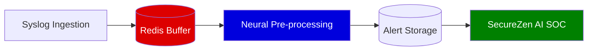

# SecureZen Syslog-AI Pipeline Architecture

This document outlines the high-performance pipeline for transforming raw syslog data into autonomous security intelligence.

## 🏗️ The 5-Layer Flow

### 1. Syslog Ingestion Layer
- **Source**: OS logs, Network devices, Application logs.
- **Mechanism**: UDP/TCP forwarding (Port 514).
- **Role**: Captures raw text stream and pushes it immediately into the buffer.

### 2. Redis Storage (The Buffer)
- **Role**: Acts as a **High-Speed Shock Absorber**.
- **Implementation**: Uses Redis `LIST` (LPUSH) or `STREAMS`.
- **Primary Benefit**: Decouples log reception from processing. Even if the AI agents are busy, logs are never lost.

### 3. Neural Pre-processing Layer
- **Role**: The **Brain/Filter**.
- **Functions**:
    - **Cleaning**: Removes noise and duplicates.
    - **Normalization**: Converts raw text into structured JSON.
    - **Enrichment**: Adds GeoIP, Threat Intel (VT/AbuseIPDB), and MITRE Mapping.
    - **Priority Scoring**: Uses AI to determine if the log is a "Non-Event" or a "Critical Threat."

### 4. Alert Storage (Persistence)
- **Role**: **Permanent Record**.
- **Implementation**: Structured SQL (SQLite/PostgreSQL).
- **Filtering**: Only "High Value" alerts identified by the pre-processor are stored here to prevent database bloat.

### 5. SecureZen AI SOC Dashboard
- **Role**: **Visual Intelligence**.
- **Function**: Queries the Alert Storage to display interactive charts, trend analysis, and autonomous investigation results.
- **Value**: Provides the "Wow" factor with clean, actionable security data.

---

## 🚀 Key Advantages

| Feature | Without This Architecture | With This Architecture |
| :--- | :--- | :--- |
| **Log Volume** | Drops logs under pressure | Redis buffers logs indefinitely |
| **Search Speed** | Scanning raw text is slow | SQL indexing on enriched fields is instant |
| **Noise Level** | SOC flooded with "Info" logs | AI pre-processor filters 95% of noise |
| **Triage** | Manual lookup for every IP | Automated AI intelligence on discovery |

---
*Created on 2026-02-11 for SecureZen Development Hub.*
